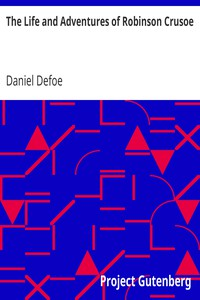

# The Life and Adventures of Robinson Crusoe <kbd>GUTHENBURGE</kbd>

## Authors

 - Defoe, Daniel <small>(-1 - 1731)</small>

## Translators

## Subjects

 - Adventure stories
 - Atlantic Ocean
 - Castaways
 - Crusoe, Robinson (Fictitious character)
 - Islands
 - Shipwreck survival

## Readablility

 - **A1:** 58%
 - **A2:** 66%
 - **B1:** 77%
 - **B2:** 90%
 - **C1:** 93%
 - **C2:** 100%

## Words Count

 - **A1:** 545
 - **A2:** 476
 - **B1:** 800
 - **B2:** 1253
 - **C1:** 519
 - **C2:** 2791

## Tagger Version

v2.0.0
