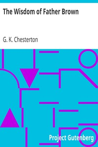

# The Wisdom of Father Brown <kbd>v2.2.1</kbd>

## Authors

 - Chesterton, G. K. (Gilbert Keith) <small>(1874 - 1936)</small>

## Translators

## Subjects

 - Brown, Father (Fictitious character)
 - Catholics
 - Clergy
 - Detective and mystery stories, English
 - England

## Readablility

 - **A1:** 76%
 - **A2:** 82%
 - **B1:** 88%
 - **B2:** 93%
 - **C1:** 98%
 - **C2:** 100%

## Words Count

 - **A1:** 492
 - **A2:** 476
 - **B1:** 849
 - **B2:** 1333
 - **C1:** 1589
 - **C2:** 1079

## Source

<kbd>GUTHENBURGE:223</kbd>
