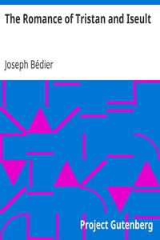

# The Romance of Tristan and Iseult <kbd>v2.2.1</kbd>

## Authors

 - Bédier, Joseph <small>(1864 - 1938)</small>

## Translators

 - Belloc, Hilaire <small>(1870 - 1953)</small>

## Subjects

 - Arthurian romances
 - Iseult (Legendary character)
 - Tristan (Legendary character)

## Readablility

 - **A1:** 78%
 - **A2:** 84%
 - **B1:** 90%
 - **B2:** 95%
 - **C1:** 98%
 - **C2:** 100%

## Words Count

 - **A1:** 461
 - **A2:** 321
 - **B1:** 492
 - **B2:** 633
 - **C1:** 491
 - **C2:** 250

## Source

<kbd>GUTHENBURGE:14244</kbd>
