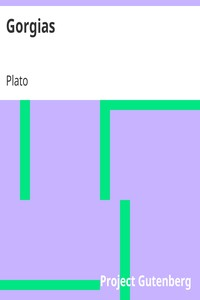

# Gorgias <kbd>v2.3.0</kbd>

## Authors

 - Plato <small>(-428 - -348)</small>

## Translators

 - Jowett, Benjamin <small>(1817 - 1893)</small>

## Subjects

 - Classical literature
 - Ethics
 - Political science

## Readablility

 - **A1:** 79%
 - **A2:** 85%
 - **B1:** 90%
 - **B2:** 95%
 - **C1:** 98%
 - **C2:** 100%

## Words Count

 - **A1:** 464
 - **A2:** 390
 - **B1:** 670
 - **B2:** 925
 - **C1:** 933
 - **C2:** 520

## Source

<kbd>GUTHENBURGE:1672</kbd>
