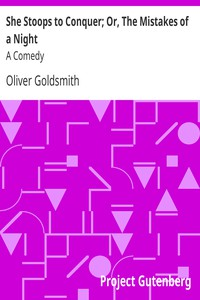

# She Stoops to Conquer; Or, The Mistakes of a Night: A Comedy <kbd>v2.0.2</kbd>

## Authors

 - Goldsmith, Oliver <small>(-1 - 1774)</small>

## Translators

## Subjects

 - Comedies

## Readablility

 - **A1:** 49%
 - **A2:** 56%
 - **B1:** 66%
 - **B2:** 80%
 - **C1:** 83%
 - **C2:** 100%

## Words Count

 - **A1:** 437
 - **A2:** 315
 - **B1:** 505
 - **B2:** 655
 - **C1:** 266
 - **C2:** 1351

## Source

<kbd>GUTHENBURGE:383</kbd>
