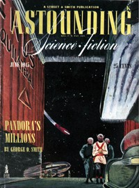

# Pandora's Millions <kbd>v2.3.0</kbd>

## Authors

 - Smith, George O. (George Oliver) <small>(1911 - 1981)</small>

## Translators

## Subjects

 - Inventions
 - Science fiction
 - Space stations
 - Technology

## Readablility

 - **A1:** 73%
 - **A2:** 79%
 - **B1:** 86%
 - **B2:** 92%
 - **C1:** 97%
 - **C2:** 100%

## Words Count

 - **A1:** 426
 - **A2:** 272
 - **B1:** 368
 - **B2:** 432
 - **C1:** 371
 - **C2:** 224

## Source

<kbd>GUTHENBURGE:68004</kbd>
