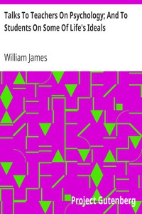

# Talks To Teachers On Psychology; And To Students On Some Of Life's Ideals <kbd>v2.2.1</kbd>

## Authors

 - James, William <small>(1842 - 1910)</small>

## Translators

## Subjects

 - College students
 - Educational psychology
 - Teachers

## Readablility

 - **A1:** 73%
 - **A2:** 79%
 - **B1:** 86%
 - **B2:** 92%
 - **C1:** 97%
 - **C2:** 100%

## Words Count

 - **A1:** 488
 - **A2:** 466
 - **B1:** 815
 - **B2:** 1248
 - **C1:** 1437
 - **C2:** 1013

## Source

<kbd>GUTHENBURGE:16287</kbd>
