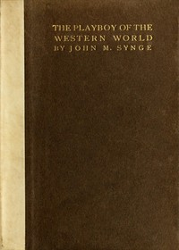

# The Playboy of the Western World: A Comedy in Three Acts <kbd>v2.2.1</kbd>

## Authors

 - Synge, J. M. (John Millington) <small>(1871 - 1909)</small>

## Translators

## Subjects

 - Ireland

## Readablility

 - **A1:** 77%
 - **A2:** 83%
 - **B1:** 88%
 - **B2:** 94%
 - **C1:** 98%
 - **C2:** 100%

## Words Count

 - **A1:** 434
 - **A2:** 299
 - **B1:** 442
 - **B2:** 536
 - **C1:** 478
 - **C2:** 263

## Source

<kbd>GUTHENBURGE:1240</kbd>
