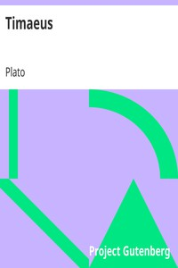

# Timaeus <kbd>v2.2.1</kbd>

## Authors

 - Plato <small>(-428 - -348)</small>

## Translators

 - Jowett, Benjamin <small>(1817 - 1893)</small>

## Subjects

 - Classical literature
 - Cosmology

## Readablility

 - **A1:** 76%
 - **A2:** 81%
 - **B1:** 87%
 - **B2:** 93%
 - **C1:** 98%
 - **C2:** 100%

## Words Count

 - **A1:** 471
 - **A2:** 402
 - **B1:** 692
 - **B2:** 999
 - **C1:** 1024
 - **C2:** 717

## Source

<kbd>GUTHENBURGE:1572</kbd>
