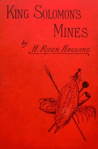

# King Solomon's Mines <kbd>v2.2.1</kbd>

## Authors

 - Haggard, H. Rider (Henry Rider) <small>(1856 - 1925)</small>

## Translators

## Subjects

 - Adventure stories
 - Africa
 - Diamond mines and mining
 - Hunting guides
 - Missing persons
 - Quatermain, Allan (Fictitious character)
 - Treasure troves

## Readablility

 - **A1:** 76%
 - **A2:** 82%
 - **B1:** 89%
 - **B2:** 94%
 - **C1:** 98%
 - **C2:** 100%

## Words Count

 - **A1:** 493
 - **A2:** 473
 - **B1:** 870
 - **B2:** 1346
 - **C1:** 1445
 - **C2:** 795

## Source

<kbd>GUTHENBURGE:2166</kbd>
