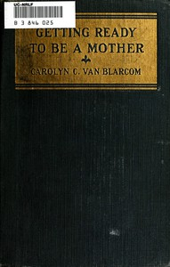

# Getting Ready to be a Mother: a little book of information and advice for the young woman who is looking forward to motherhood <kbd>v2.2.1</kbd>

## Authors

 - Van Blarcom, Carolyn Conant <small>(1875 - 1961)</small>

## Translators

## Subjects

 - Infants
 - Obstetrics
 - Pregnancy

## Readablility

 - **A1:** 70%
 - **A2:** 77%
 - **B1:** 84%
 - **B2:** 91%
 - **C1:** 96%
 - **C2:** 100%

## Words Count

 - **A1:** 466
 - **A2:** 380
 - **B1:** 628
 - **B2:** 892
 - **C1:** 997
 - **C2:** 692

## Source

<kbd>GUTHENBURGE:67971</kbd>
