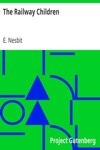

# The Railway Children <kbd>v2.0.2</kbd>

## Authors

 - Nesbit, E. (Edith) <small>(1858 - 1924)</small>

## Translators

## Subjects

 - Brothers and sisters
 - Country life
 - England
 - Family life
 - Railroads

## Readablility

 - **A1:** 55%
 - **A2:** 62%
 - **B1:** 72%
 - **B2:** 83%
 - **C1:** 87%
 - **C2:** 100%

## Words Count

 - **A1:** 541
 - **A2:** 407
 - **B1:** 683
 - **B2:** 989
 - **C1:** 422
 - **C2:** 2242

## Source

<kbd>GUTHENBURGE:1874</kbd>
