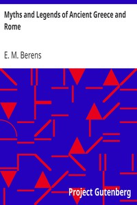

# Myths and Legends of Ancient Greece and Rome <kbd>v2.2.1</kbd>

## Authors

 - Berens, E. M. <small>(-1 - -1)</small>

## Translators

## Subjects

 - Mythology, Classical

## Readablility

 - **A1:** 71%
 - **A2:** 77%
 - **B1:** 84%
 - **B2:** 91%
 - **C1:** 97%
 - **C2:** 100%

## Words Count

 - **A1:** 482
 - **A2:** 461
 - **B1:** 870
 - **B2:** 1454
 - **C1:** 1865
 - **C2:** 1265

## Source

<kbd>GUTHENBURGE:22381</kbd>
