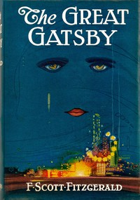

# The Great Gatsby <kbd>GUTHENBURGE</kbd>

## Authors

 - Fitzgerald, F. Scott (Francis Scott) <small>(1896 - 1940)</small>

## Translators

## Subjects

 - First loves
 - Long Island (N.Y.)
 - Married women
 - Psychological fiction
 - Rich people

## Readablility

 - **A1:** 54%
 - **A2:** 60%
 - **B1:** 70%
 - **B2:** 83%
 - **C1:** 86%
 - **C2:** 100%

## Words Count

 - **A1:** 552
 - **A2:** 486
 - **B1:** 791
 - **B2:** 1154
 - **C1:** 472
 - **C2:** 2883

## Tagger Version

v2.0.2
