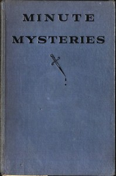

# Minute Mysteries [Detectograms] <kbd>v2.2.1</kbd>

## Authors

 - Ripley, H. A. (Harold Austin) <small>(1896 - -1)</small>

## Translators

## Subjects

 - Detective and mystery stories
 - Puzzles

## Readablility

 - **A1:** 74%
 - **A2:** 81%
 - **B1:** 87%
 - **B2:** 93%
 - **C1:** 98%
 - **C2:** 100%

## Words Count

 - **A1:** 471
 - **A2:** 379
 - **B1:** 583
 - **B2:** 721
 - **C1:** 660
 - **C2:** 353

## Source

<kbd>GUTHENBURGE:50603</kbd>
