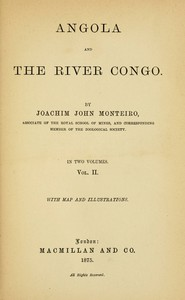

# Angola and the River Congo, vol. 2 <kbd>v2.2.1</kbd>

## Authors

 - Monteiro, Joachim John <small>(1833 - 1878)</small>

## Translators

## Subjects

## Readablility

 - **A1:** 72%
 - **A2:** 78%
 - **B1:** 86%
 - **B2:** 92%
 - **C1:** 97%
 - **C2:** 100%

## Words Count

 - **A1:** 483
 - **A2:** 443
 - **B1:** 799
 - **B2:** 1191
 - **C1:** 1358
 - **C2:** 979

## Source

<kbd>GUTHENBURGE:68176</kbd>
