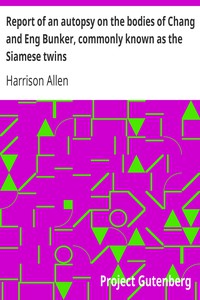

# Report of an autopsy on the bodies of Chang and Eng Bunker, commonly known as the Siamese twins <kbd>v2.2.1</kbd>

## Authors

 - Allen, Harrison <small>(1841 - 1897)</small>

## Translators

## Subjects

 - Conjoined twins

## Readablility

 - **A1:** 70%
 - **A2:** 76%
 - **B1:** 83%
 - **B2:** 89%
 - **C1:** 95%
 - **C2:** 99%

## Words Count

 - **A1:** 345
 - **A2:** 190
 - **B1:** 277
 - **B2:** 326
 - **C1:** 283
 - **C2:** 144

## Source

<kbd>GUTHENBURGE:68165</kbd>
