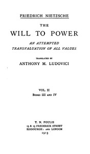

# The Will to Power: An Attempted Transvaluation of All Values. Book III and IV <kbd>v2.2.1</kbd>

## Authors

 - Nietzsche, Friedrich Wilhelm <small>(1844 - 1900)</small>

## Translators

 - Ludovici, Anthony M. (Anthony Mario) <small>(1882 - 1971)</small>

## Subjects

 - Nihilism (Philosophy)
 - Power (Philosophy)
 - Values

## Readablility

 - **A1:** 73%
 - **A2:** 79%
 - **B1:** 85%
 - **B2:** 92%
 - **C1:** 97%
 - **C2:** 100%

## Words Count

 - **A1:** 475
 - **A2:** 420
 - **B1:** 751
 - **B2:** 1153
 - **C1:** 1381
 - **C2:** 1202

## Source

<kbd>GUTHENBURGE:52915</kbd>
