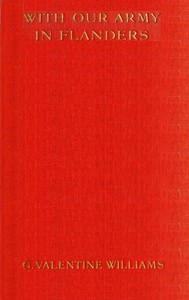

# With our army in Flanders <kbd>v2.2.1</kbd>

## Authors

 - Williams, Valentine <small>(1883 - 1946)</small>

## Translators

## Subjects

 - World War, 1914-1918

## Readablility

 - **A1:** 73%
 - **A2:** 79%
 - **B1:** 85%
 - **B2:** 91%
 - **C1:** 97%
 - **C2:** 100%

## Words Count

 - **A1:** 490
 - **A2:** 486
 - **B1:** 905
 - **B2:** 1478
 - **C1:** 1817
 - **C2:** 1497

## Source

<kbd>GUTHENBURGE:68038</kbd>
