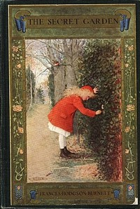

# The Secret Garden <kbd>v2.2.1</kbd>

## Authors

 - Burnett, Frances Hodgson <small>(1849 - 1924)</small>

## Translators

## Subjects

 - Gardens
 - Orphans
 - People with disabilities
 - Yorkshire (England)

## Readablility

 - **A1:** 80%
 - **A2:** 86%
 - **B1:** 91%
 - **B2:** 96%
 - **C1:** 98%
 - **C2:** 100%

## Words Count

 - **A1:** 485
 - **A2:** 426
 - **B1:** 680
 - **B2:** 889
 - **C1:** 884
 - **C2:** 474

## Source

<kbd>GUTHENBURGE:17396</kbd>
