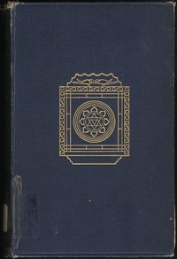

# Omens and Superstitions of Southern India <kbd>v2.3.0</kbd>

## Authors

 - Thurston, Edgar <small>(1855 - 1935)</small>

## Translators

## Subjects

 - Dravidians
 - Folklore
 - Occultism
 - Omens
 - Superstition

## Readablility

 - **A1:** 72%
 - **A2:** 78%
 - **B1:** 84%
 - **B2:** 91%
 - **C1:** 97%
 - **C2:** 100%

## Words Count

 - **A1:** 490
 - **A2:** 457
 - **B1:** 824
 - **B2:** 1295
 - **C1:** 1578
 - **C2:** 1161

## Source

<kbd>GUTHENBURGE:35690</kbd>
