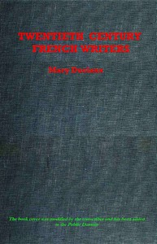

# Twentieth Century French Writers: Reviews and Reminiscences <kbd>v2.3.0</kbd>

## Authors

 - Robinson, A. Mary F. (Agnes Mary Frances) <small>(1857 - 1944)</small>

## Translators

## Subjects

 - French literature

## Readablility

 - **A1:** 74%
 - **A2:** 80%
 - **B1:** 85%
 - **B2:** 91%
 - **C1:** 96%
 - **C2:** 100%

## Words Count

 - **A1:** 491
 - **A2:** 466
 - **B1:** 835
 - **B2:** 1318
 - **C1:** 1589
 - **C2:** 1241

## Source

<kbd>GUTHENBURGE:67992</kbd>
