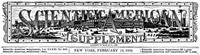

# Scientific American Supplement, No. 841, February 13, 1892 <kbd>v2.3.0</kbd>

## Authors

 - Various <small>(-1 - -1)</small>

## Translators

## Subjects

 - Science

## Readablility

 - **A1:** 69%
 - **A2:** 76%
 - **B1:** 83%
 - **B2:** 90%
 - **C1:** 96%
 - **C2:** 100%

## Words Count

 - **A1:** 474
 - **A2:** 427
 - **B1:** 715
 - **B2:** 1048
 - **C1:** 1186
 - **C2:** 771

## Source

<kbd>GUTHENBURGE:15193</kbd>
