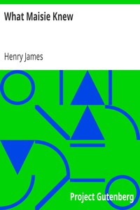

# What Maisie Knew <kbd>v2.2.1</kbd>

## Authors

 - James, Henry <small>(1843 - 1916)</small>

## Translators

## Subjects

 - Bildungsromans
 - Children of divorced parents
 - Domestic fiction
 - Girls
 - Governesses
 - Remarried people

## Readablility

 - **A1:** 80%
 - **A2:** 85%
 - **B1:** 90%
 - **B2:** 94%
 - **C1:** 98%
 - **C2:** 100%

## Words Count

 - **A1:** 485
 - **A2:** 462
 - **B1:** 824
 - **B2:** 1290
 - **C1:** 1481
 - **C2:** 954

## Source

<kbd>GUTHENBURGE:7118</kbd>
