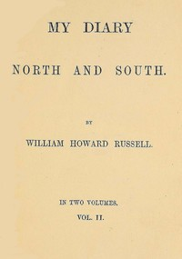

# My Diary: North and South (vol. 2 of 2) <kbd>v2.2.1</kbd>

## Authors

 - Russell, William Howard, Sir <small>(1820 - 1907)</small>

## Translators

## Subjects

 - Confederate States of America
 - Russell, William Howard, Sir, 1820-1907
 - Russell, William Howard, Sir, 1820-1907
 - United States
 - United States

## Readablility

 - **A1:** 74%
 - **A2:** 81%
 - **B1:** 87%
 - **B2:** 93%
 - **C1:** 98%
 - **C2:** 100%

## Words Count

 - **A1:** 492
 - **A2:** 494
 - **B1:** 943
 - **B2:** 1640
 - **C1:** 2213
 - **C2:** 1536

## Source

<kbd>GUTHENBURGE:68126</kbd>
