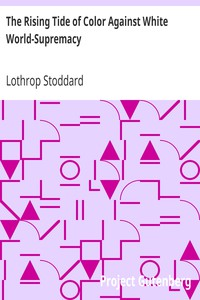

# The Rising Tide of Color Against White World-Supremacy <kbd>v2.2.1</kbd>

## Authors

 - Stoddard, Lothrop <small>(1883 - 1950)</small>

## Translators

## Subjects

 - Caucasian race
 - Race relations

## Readablility

 - **A1:** 71%
 - **A2:** 76%
 - **B1:** 83%
 - **B2:** 90%
 - **C1:** 96%
 - **C2:** 100%

## Words Count

 - **A1:** 477
 - **A2:** 441
 - **B1:** 807
 - **B2:** 1271
 - **C1:** 1657
 - **C2:** 1365

## Source

<kbd>GUTHENBURGE:37408</kbd>
