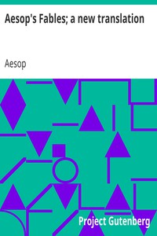

# Aesop's Fables; a new translation <kbd>v2.3.0</kbd>

## Authors

 - Aesop <small>(-1 - -1)</small>

## Translators

 - Vernon Jones, V. S. (Vernon Stanley) <small>(-1 - -1)</small>

## Subjects

 - Fables, Greek

## Readablility

 - **A1:** 76%
 - **A2:** 81%
 - **B1:** 87%
 - **B2:** 92%
 - **C1:** 98%
 - **C2:** 100%

## Words Count

 - **A1:** 480
 - **A2:** 424
 - **B1:** 691
 - **B2:** 889
 - **C1:** 911
 - **C2:** 439

## Source

<kbd>GUTHENBURGE:11339</kbd>
