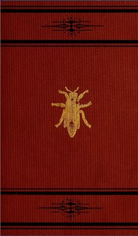

# Manual of the apiary <kbd>v2.3.0</kbd>

## Authors

 - Cook, Albert John <small>(1842 - 1916)</small>

## Translators

## Subjects

 - Bee culture
 - Bees

## Readablility

 - **A1:** 70%
 - **A2:** 75%
 - **B1:** 82%
 - **B2:** 88%
 - **C1:** 96%
 - **C2:** 99%

## Words Count

 - **A1:** 480
 - **A2:** 438
 - **B1:** 781
 - **B2:** 1122
 - **C1:** 1450
 - **C2:** 1191

## Source

<kbd>GUTHENBURGE:68157</kbd>
