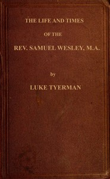

# The life and times of the Rev. Samuel Wesley: Rector of Epworth and father of the Revs. John and Charles Wesley, the founders of the Methodists <kbd>v2.2.1</kbd>

## Authors

 - Tyerman, L. (Luke) <small>(1819 - 1889)</small>

## Translators

## Subjects

 - Church of England
 - Wesley, Samuel, 1662-1735

## Readablility

 - **A1:** 75%
 - **A2:** 81%
 - **B1:** 87%
 - **B2:** 92%
 - **C1:** 97%
 - **C2:** 100%

## Words Count

 - **A1:** 494
 - **A2:** 498
 - **B1:** 969
 - **B2:** 1726
 - **C1:** 2503
 - **C2:** 2069

## Source

<kbd>GUTHENBURGE:67980</kbd>
