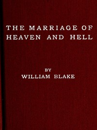

# The Marriage of Heaven and Hell <kbd>v2.3.0</kbd>

## Authors

 - Blake, William <small>(1757 - 1827)</small>

## Translators

## Subjects

 - Heaven
 - Hell
 - Mysticism

## Readablility

 - **A1:** 70%
 - **A2:** 76%
 - **B1:** 84%
 - **B2:** 92%
 - **C1:** 98%
 - **C2:** 100%

## Words Count

 - **A1:** 384
 - **A2:** 194
 - **B1:** 285
 - **B2:** 380
 - **C1:** 282
 - **C2:** 97

## Source

<kbd>GUTHENBURGE:45315</kbd>
