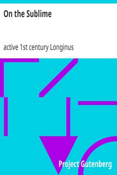

# On the Sublime <kbd>v2.3.0</kbd>

## Authors

 - Longinus, active 1st century <small>(-1 - -1)</small>

## Translators

 - Havell, H. L. (Herbert Lord) <small>(-1 - 1913)</small>

## Subjects

 - Rhetoric, Ancient
 - Sublime, The

## Readablility

 - **A1:** 73%
 - **A2:** 79%
 - **B1:** 85%
 - **B2:** 92%
 - **C1:** 97%
 - **C2:** 100%

## Words Count

 - **A1:** 477
 - **A2:** 390
 - **B1:** 660
 - **B2:** 931
 - **C1:** 963
 - **C2:** 554

## Source

<kbd>GUTHENBURGE:17957</kbd>
