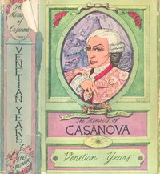

# The Memoirs of Jacques Casanova de Seingalt, 1725-1798. Complete <kbd>v2.3.0</kbd>

## Authors

 - Casanova, Giacomo <small>(1725 - 1798)</small>

## Translators

 - Machen, Arthur <small>(1863 - 1947)</small>

## Subjects

 - Casanova, Giacomo, 1725-1798
 - Europe

## Readablility

 - **A1:** 79%
 - **A2:** 85%
 - **B1:** 90%
 - **B2:** 95%
 - **C1:** 98%
 - **C2:** 100%

## Words Count

 - **A1:** 493
 - **A2:** 496
 - **B1:** 991
 - **B2:** 1936
 - **C1:** 3419
 - **C2:** 3752

## Source

<kbd>GUTHENBURGE:2981</kbd>
