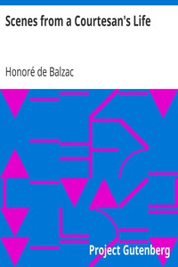

# Scenes from a Courtesan's Life <kbd>v2.3.0</kbd>

## Authors

 - Balzac, Honoré de <small>(1799 - 1850)</small>

## Translators

 - Waring, James <small>(-1 - -1)</small>

## Subjects

 - France
 - French fiction

## Readablility

 - **A1:** 77%
 - **A2:** 83%
 - **B1:** 88%
 - **B2:** 93%
 - **C1:** 98%
 - **C2:** 100%

## Words Count

 - **A1:** 490
 - **A2:** 491
 - **B1:** 962
 - **B2:** 1735
 - **C1:** 2442
 - **C2:** 1887

## Source

<kbd>GUTHENBURGE:1660</kbd>
