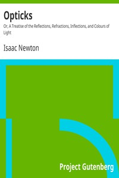

# Opticks: Or, A Treatise of the Reflections, Refractions, Inflections, and Colours of Light <kbd>v2.2.1</kbd>

## Authors

 - Newton, Isaac <small>(1642 - 1727)</small>

## Translators

## Subjects

 - Optics

## Readablility

 - **A1:** 75%
 - **A2:** 81%
 - **B1:** 86%
 - **B2:** 92%
 - **C1:** 96%
 - **C2:** 100%

## Words Count

 - **A1:** 433
 - **A2:** 317
 - **B1:** 482
 - **B2:** 676
 - **C1:** 682
 - **C2:** 486

## Source

<kbd>GUTHENBURGE:33504</kbd>
