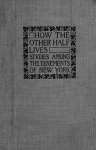

# How the Other Half Lives: Studies Among the Tenements of New York <kbd>v2.2.1</kbd>

## Authors

 - Riis, Jacob A. (Jacob August) <small>(1849 - 1914)</small>

## Translators

## Subjects

 - Poor
 - Tenement houses

## Readablility

 - **A1:** 72%
 - **A2:** 79%
 - **B1:** 85%
 - **B2:** 91%
 - **C1:** 97%
 - **C2:** 100%

## Words Count

 - **A1:** 492
 - **A2:** 476
 - **B1:** 851
 - **B2:** 1418
 - **C1:** 1705
 - **C2:** 1272

## Source

<kbd>GUTHENBURGE:45502</kbd>
