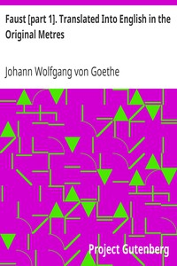

# Faust [part 1]. Translated Into English in the Original Metres <kbd>v2.3.0</kbd>

## Authors

 - Goethe, Johann Wolfgang von <small>(1749 - 1832)</small>

## Translators

 - Taylor, Bayard <small>(1825 - 1878)</small>

## Subjects

 - Faust, -approximately 1540
 - German poetry
 - Legends
 - Magicians

## Readablility

 - **A1:** 72%
 - **A2:** 78%
 - **B1:** 84%
 - **B2:** 91%
 - **C1:** 97%
 - **C2:** 100%

## Words Count

 - **A1:** 485
 - **A2:** 435
 - **B1:** 722
 - **B2:** 1055
 - **C1:** 1242
 - **C2:** 835

## Source

<kbd>GUTHENBURGE:14591</kbd>
