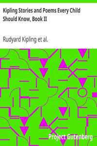

# Kipling Stories and Poems Every Child Should Know, Book II <kbd>v2.2.1</kbd>

## Authors

 - Kipling, Rudyard <small>(1865 - 1936)</small>

## Translators

## Subjects

 - Poetry
 - Short stories

## Readablility

 - **A1:** 76%
 - **A2:** 82%
 - **B1:** 87%
 - **B2:** 93%
 - **C1:** 97%
 - **C2:** 100%

## Words Count

 - **A1:** 492
 - **A2:** 453
 - **B1:** 789
 - **B2:** 1096
 - **C1:** 1157
 - **C2:** 736

## Source

<kbd>GUTHENBURGE:30568</kbd>
