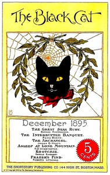

# The black cat (vol. i, no. 3, December 1895) <kbd>v2.2.1</kbd>

## Authors

 - Various <small>(-1 - -1)</small>

## Translators

## Subjects

 - Short stories, American

## Readablility

 - **A1:** 72%
 - **A2:** 78%
 - **B1:** 85%
 - **B2:** 92%
 - **C1:** 97%
 - **C2:** 100%

## Words Count

 - **A1:** 480
 - **A2:** 418
 - **B1:** 682
 - **B2:** 916
 - **C1:** 842
 - **C2:** 456

## Source

<kbd>GUTHENBURGE:68160</kbd>
