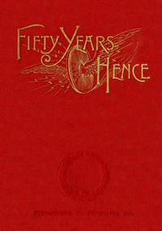

# Fifty years hence: or, What may be in 1943: A prophecy supposed to be based on scientific deductions by an improved graphical method <kbd>v2.3.0</kbd>

## Authors

 - Grimshaw, Robert <small>(1850 - 1941)</small>

## Translators

## Subjects

 - Twentieth century
 - Utopias

## Readablility

 - **A1:** 70%
 - **A2:** 76%
 - **B1:** 83%
 - **B2:** 91%
 - **C1:** 97%
 - **C2:** 100%

## Words Count

 - **A1:** 468
 - **A2:** 359
 - **B1:** 589
 - **B2:** 789
 - **C1:** 761
 - **C2:** 469

## Source

<kbd>GUTHENBURGE:68096</kbd>
