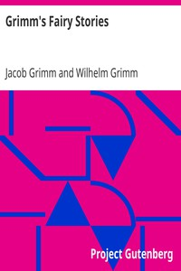

# Grimm's Fairy Stories <kbd>v2.2.1</kbd>

## Authors

 - Grimm, Wilhelm <small>(1786 - 1859)</small>
 - Grimm, Jacob <small>(1785 - 1863)</small>

## Translators

## Subjects

 - Fairy tales
 - Fairy tales

## Readablility

 - **A1:** 79%
 - **A2:** 85%
 - **B1:** 91%
 - **B2:** 95%
 - **C1:** 99%
 - **C2:** 100%

## Words Count

 - **A1:** 485
 - **A2:** 410
 - **B1:** 675
 - **B2:** 850
 - **C1:** 747
 - **C2:** 330

## Source

<kbd>GUTHENBURGE:11027</kbd>
