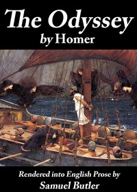

# The Odyssey: Rendered into English prose for the use of those who cannot read the original <kbd>GUTHENBURGE</kbd>

## Authors

 - Homer <small>(-750 - -650)</small>

## Translators

 - Butler, Samuel <small>(1835 - 1902)</small>

## Subjects

 - Epic poetry, Greek
 - Homer
 - Odysseus, King of Ithaca (Mythological character)

## Readablility

 - **A1:** 57%
 - **A2:** 63%
 - **B1:** 73%
 - **B2:** 86%
 - **C1:** 89%
 - **C2:** 100%

## Words Count

 - **A1:** 579
 - **A2:** 504
 - **B1:** 854
 - **B2:** 1261
 - **C1:** 555
 - **C2:** 3940

## Tagger Version

v2.0.0
