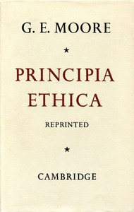

# Principia Ethica <kbd>v2.3.0</kbd>

## Authors

 - Moore, G. E. (George Edward) <small>(1873 - 1958)</small>

## Translators

## Subjects

 - Ethics

## Readablility

 - **A1:** 76%
 - **A2:** 83%
 - **B1:** 88%
 - **B2:** 94%
 - **C1:** 98%
 - **C2:** 100%

## Words Count

 - **A1:** 426
 - **A2:** 338
 - **B1:** 520
 - **B2:** 763
 - **C1:** 734
 - **C2:** 396

## Source

<kbd>GUTHENBURGE:53430</kbd>
