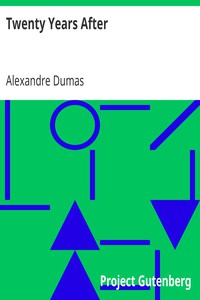

# Twenty Years After <kbd>v2.2.1</kbd>

## Authors

 - Dumas, Alexandre <small>(1802 - 1870)</small>

## Translators

## Subjects

 - France

## Readablility

 - **A1:** 78%
 - **A2:** 84%
 - **B1:** 90%
 - **B2:** 95%
 - **C1:** 98%
 - **C2:** 100%

## Words Count

 - **A1:** 494
 - **A2:** 490
 - **B1:** 958
 - **B2:** 1698
 - **C1:** 2295
 - **C2:** 1639

## Source

<kbd>GUTHENBURGE:1259</kbd>
