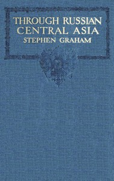

# Through Russian Central Asia <kbd>v2.3.0</kbd>

## Authors

 - Graham, Stephen <small>(1884 - 1975)</small>

## Translators

## Subjects

 - Asia, Central
 - Graham, Stephen, 1884-1975

## Readablility

 - **A1:** 74%
 - **A2:** 80%
 - **B1:** 86%
 - **B2:** 93%
 - **C1:** 97%
 - **C2:** 100%

## Words Count

 - **A1:** 492
 - **A2:** 483
 - **B1:** 845
 - **B2:** 1318
 - **C1:** 1581
 - **C2:** 1038

## Source

<kbd>GUTHENBURGE:67938</kbd>
