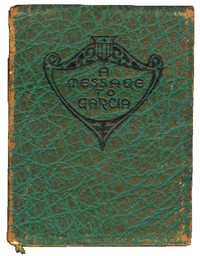

# A Message to Garcia: Being a Preachment <kbd>v2.2.1</kbd>

## Authors

 - Hubbard, Elbert <small>(1856 - 1915)</small>

## Translators

## Subjects

 - Rowan, Andrew Summers
 - Spanish-American War, 1898
 - Success

## Readablility

 - **A1:** 71%
 - **A2:** 78%
 - **B1:** 86%
 - **B2:** 93%
 - **C1:** 98%
 - **C2:** 100%

## Words Count

 - **A1:** 334
 - **A2:** 161
 - **B1:** 226
 - **B2:** 249
 - **C1:** 182
 - **C2:** 68

## Source

<kbd>GUTHENBURGE:17195</kbd>
