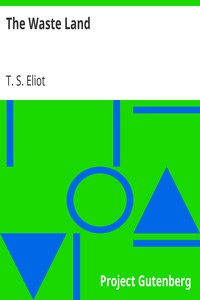

# The Waste Land <kbd>v2.3.0</kbd>

## Authors

 - Eliot, T. S. (Thomas Stearns) <small>(1888 - 1965)</small>

## Translators

## Subjects

 - Poetry
 - Prose poems

## Readablility

 - **A1:** 71%
 - **A2:** 78%
 - **B1:** 85%
 - **B2:** 92%
 - **C1:** 98%
 - **C2:** 100%

## Words Count

 - **A1:** 384
 - **A2:** 214
 - **B1:** 281
 - **B2:** 345
 - **C1:** 262
 - **C2:** 132

## Source

<kbd>GUTHENBURGE:1321</kbd>
