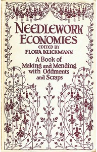

# Needlework Economies: A Book of Mending and Making with Oddments and Scraps <kbd>v2.3.0</kbd>

## Authors

## Translators

## Subjects

 - Fancy work
 - Needlework
 - Repairing

## Readablility

 - **A1:** 70%
 - **A2:** 76%
 - **B1:** 83%
 - **B2:** 89%
 - **C1:** 96%
 - **C2:** 100%

## Words Count

 - **A1:** 440
 - **A2:** 323
 - **B1:** 521
 - **B2:** 629
 - **C1:** 641
 - **C2:** 377

## Source

<kbd>GUTHENBURGE:48050</kbd>
