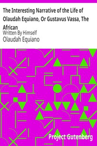

# The Interesting Narrative of the Life of Olaudah Equiano, Or Gustavus Vassa, The African: Written By Himself <kbd>v2.2.1</kbd>

## Authors

 - Equiano, Olaudah <small>(1745 - 1797)</small>

## Translators

## Subjects

 - Equiano, Olaudah, 1745-1797
 - Slaves
 - Slaves

## Readablility

 - **A1:** 78%
 - **A2:** 84%
 - **B1:** 90%
 - **B2:** 95%
 - **C1:** 99%
 - **C2:** 100%

## Words Count

 - **A1:** 490
 - **A2:** 456
 - **B1:** 831
 - **B2:** 1298
 - **C1:** 1360
 - **C2:** 713

## Source

<kbd>GUTHENBURGE:15399</kbd>
