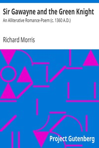

# Sir Gawayne and the Green Knight: An Alliterative Romance-Poem (c. 1360 A.D.) <kbd>v2.3.0</kbd>

## Authors

## Translators

## Subjects

 - Arthurian romances
 - Gawain (Legendary character)

## Readablility

 - **A1:** 82%
 - **A2:** 84%
 - **B1:** 88%
 - **B2:** 92%
 - **C1:** 96%
 - **C2:** 99%

## Words Count

 - **A1:** 439
 - **A2:** 302
 - **B1:** 452
 - **B2:** 554
 - **C1:** 503
 - **C2:** 283

## Source

<kbd>GUTHENBURGE:14568</kbd>
