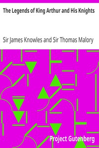

# The Legends of King Arthur and His Knights <kbd>v2.2.1</kbd>

## Authors

 - Malory, Thomas, Sir <small>(-1 - 1471)</small>
 - Knowles, James, Sir <small>(1831 - 1908)</small>

## Translators

## Subjects

 - Arthur, King
 - Arthurian romances
 - Folklore
 - Knights and knighthood

## Readablility

 - **A1:** 77%
 - **A2:** 82%
 - **B1:** 87%
 - **B2:** 93%
 - **C1:** 99%
 - **C2:** 100%

## Words Count

 - **A1:** 474
 - **A2:** 411
 - **B1:** 661
 - **B2:** 875
 - **C1:** 908
 - **C2:** 416

## Source

<kbd>GUTHENBURGE:12753</kbd>
